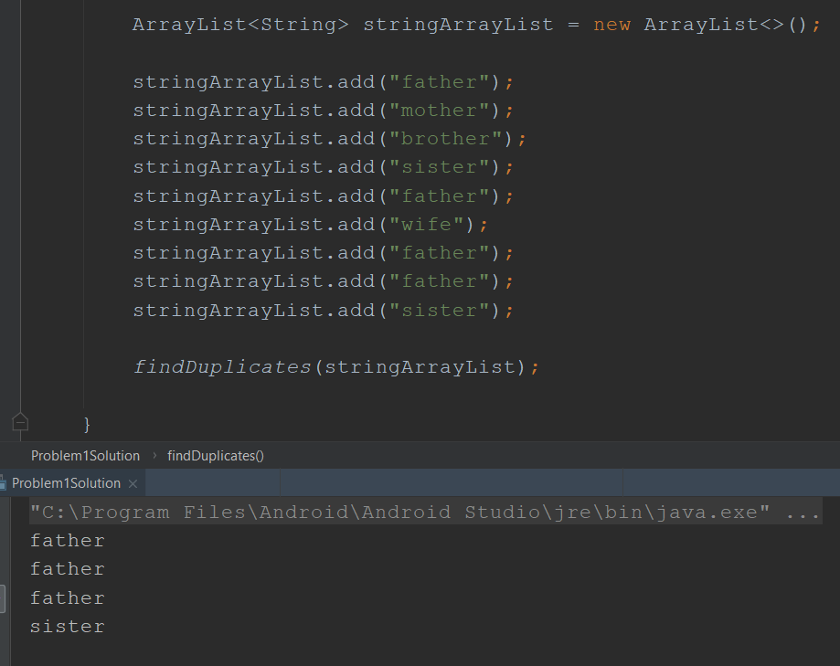
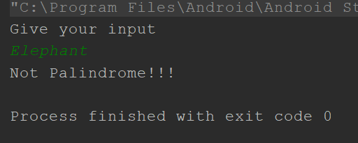
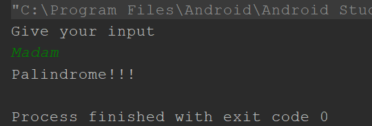
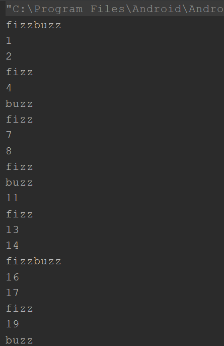
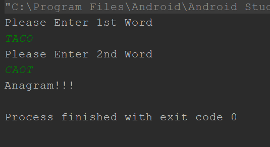
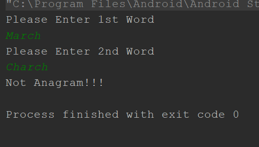
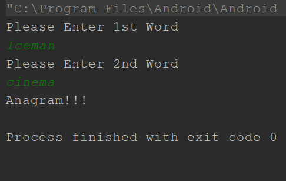
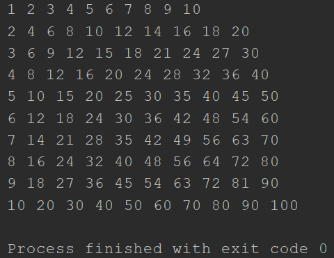

# week1day2homework
This is week 1 day 2 home assignment. For every different problem there is java class.
Screenshot of output for the Problem 1.

User need to provide data to see the output. For example, the green colored word is given by user in screenshots.
Screenshots of output for the Problem 2.

Screenshot of output for the Problem 3.

User need to provide data to see the output. For example, the green colored word is given by user in screenshots.
Screenshotz of output for the Problem 4.

Screenshot of output for the Problem 5.

